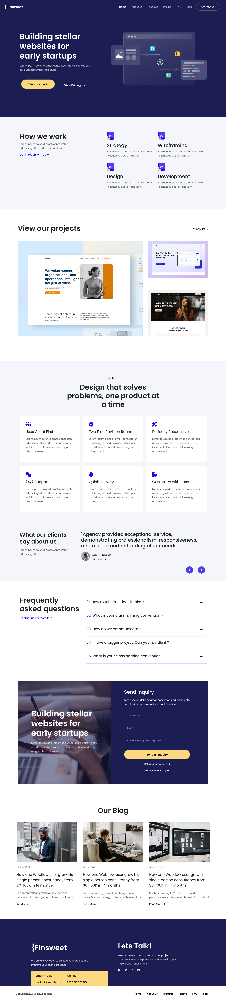

# Finsweet Website

This project is a website template for a digital agency called Finsweet. The website includes various sections such as a home page, about page, features, pricing, blog, and more. It is built using HTML, CSS, and JavaScript, with the Bootstrap framework for responsive design and Font Awesome for icons.

## Table of Contents

- [Design](#design)
- [Usage](#usage)
- [Technologies Used](#technologies-used)
- [Features](#features)
- [Links](#links)
- [Credits](#credits)
- [Author](#author)

## Design

## Usage

- The website can be used as a template for digital agencies or startups.
- Customize the content in the HTML files and styles in the CSS files to match your needs.

## Technologies Used

- HTML5
- CSS3
- JavaScript
- Bootstrap 5
- Font Awesome
- Google Fonts

## Features

- **Responsive Design**: Built using Bootstrap to ensure the website is responsive and mobile-friendly.
- **Customizable Sections**: Easily modify the content and style of various sections like Home, About, Features, Pricing, Blog, and Contact.
- **Interactive Elements**: Includes a carousel for client testimonials and collapsible FAQ sections for a dynamic user experience.
- **Modern Design**: Uses modern web design practices with a clean and professional look.

### Links

- GitHub Repo: [Solution](https://github.com/basemsameh/Client-Template-Webflow-Agency.git)
- Live Site URL: [Demo](https://basemsameh.github.io/Client-Template-Webflow-Agency/index.html)

## Credits

- **Bootstrap**: [https://getbootstrap.com/](https://getbootstrap.com/)
- **Font Awesome**: [https://fontawesome.com/](https://fontawesome.com/)
- **Google Fonts**: [https://fonts.google.com/](https://fonts.google.com/)

## Author

- Linkedin - [Basem Sameh](https://www.linkedin.com/in/basem-sameh-671b5b212/)